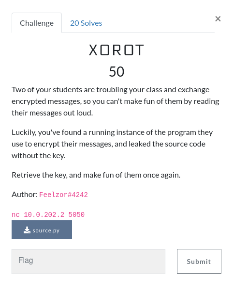

# GreHack 2022: XOROT

## Challenge sources



First let's have a look on the source code:

```python
import base64
import string
import random
from itertools import cycle
from langdetect import detect_langs

symbols = string.printable
key = "REDACTED"


def rot(n, s):
    encoded = symbols[n:] + symbols[:n]
    lookup = str.maketrans(symbols, encoded)
    return s.translate(lookup)


def is_english(text):
    for lang in detect_langs(text):
        if lang.lang == "en":
            return lang.prob > 0.8

    return False


user_text = input("Please enter your text: ")
if not is_english(user_text):
    print("The input text must be an english sentence.")
    exit(1)

rot_text = rot(random.randint(1, 25), user_text)
xor_text = ''.join(chr(ord(c) ^ ord(k)) for c, k in zip(rot_text, cycle(key)))

b64_bytes = base64.b64encode(bytes(xor_text, 'utf-8'))
print(b64_bytes.decode('utf-8'))
```

As we can see, the plaintext message is first ciphered with a random ROT (between 1 and 25), and then the ROT message is ciphered by XOR cipher with an unknown key. The english language check is not relevant in the ciphering process.

Secondly, when we connect on the provided server, we have access to the cipher tool (which is running the given sources), and we are asked to enter a message which will be ciphered.

## Solving the challenge

Since we have access to the details of the ciphering process, and since we can obtain the encrypted version of a plaintext message of our choice, we can perform a plaintext attack: If we know the plaintext and the encyrpted message, the key can be deduced by XORing the plaintext by the encrypted message.

The problem is, before the XOR, a ROT is performed on the plaintext message. But there is only 25 possibilities of outputs for the ROT, so it is easily bruteforcable if we try to XOR every possible ouput of ROT.

At the end, we will obtain 25 key candidates, but I'm pretty sure the key will start by "GH22" :)

Here is a script I quickly wrote during the CTF, it ain't much but it's honest work !

```python
import base64
import string
import random
from itertools import cycle

symbols = string.printable

# Fetched from the sources

def rot(n, s):
    encoded = symbols[n:] + symbols[:n]
    lookup = str.maketrans(symbols, encoded)
    return s.translate(lookup)


# I Think I was hungry when i wrote this plaintext

clear="hello world i love cakes with salad and fruits and love"
crypted = "BDJ1dTE+HRhmFTYyGw80FSIOD0lHGRR+Eg03KiATPEU6MTFURDIhKRNmAgsbEQ8FFgoSLntgJQ=="

# First we prepare the encrypted message for further computing

b64_bytes = base64.b64decode(crypted)
b64_decoded = b64_bytes.decode('utf-8')

all_rot = dict()

possible_keys = dict()

# We compute all possible ROT outputs

for i in range(1,26):
    all_rot[i] = rot(i, clear)

# We do the plaintext attack with all ROT outputs

for i in range(1,26):
    r = all_rot[i]

    k = ''.join(chr(ord(c) ^ ord(k)) for c,k in zip(r, b64_decoded))
    possible_keys[i] = k

# We deduce which key is the flag

flag = ""
for i in range(1,26):
    if "GH22" in possible_keys[i]:
        flag = possible_keys[i]

# We prettify the output and then we print the flag ! "And, voilà !"

flag = flag[:flag.index("}") + 1]

print(flag)
```


